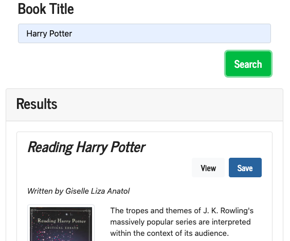

# Google-Books

Google Books is a react application that searches for books via the Google Books API. This application uses React.js, Node, Express, Google Books API and MongoDB. 

## How to use it:
**Link: [Google Books](https://search-books-react.herokuapp.com/)**

**1. Enter the book's title and click search.**

